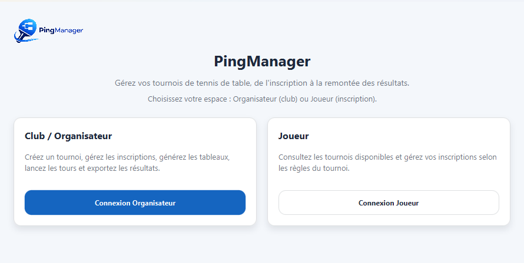
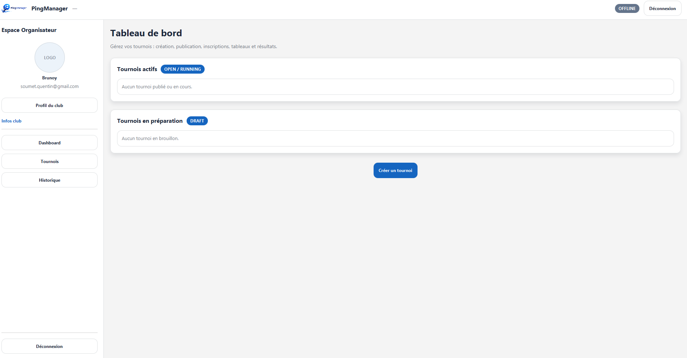
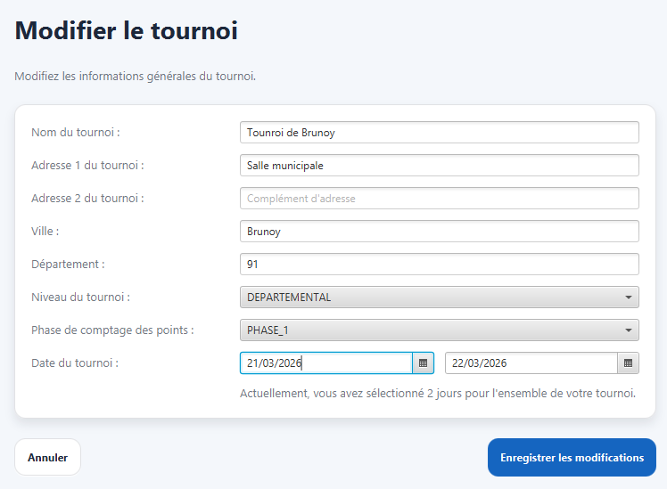
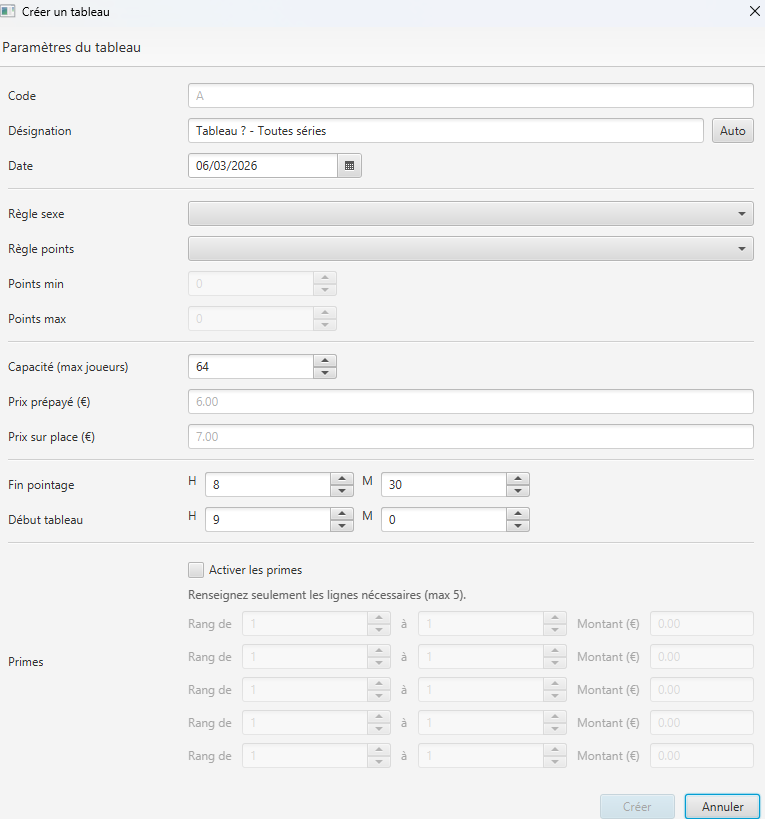

# PingManager – Gestion Tournois FFTT


---

## Présentation

PingManager est une application desktop destinée à la gestion complète de tournois de tennis de table selon les règles de la FFTT.

Le logiciel permet :

- la création et la configuration de tournois
- la définition des tableaux (catégories, points, sexe, capacité)
- la gestion des inscriptions multi-tableaux
- l'application stricte des règles FFTT
- la gestion des paiements (sur place / en ligne)
- le fonctionnement hors ligne pendant la compétition

L’objectif est de fournir un outil robuste, utilisable en conditions réelles de tournoi.

---

## Architecture

Le projet suit une architecture **DDD (Domain Driven Design)**.

Séparation claire entre :

- `domain` → règles métier
- `ui/javafx` → interface utilisateur
- `infra` → accès base SQLite
- `common` → gestion des erreurs

Le cœur métier ne dépend ni de JavaFX ni de SQLite.

---

# 🧠 Modèle métier

## Agrégat principal : Tournament

Le tournoi est l’agrégat racine.

Il garantit :

- cohérence des tableaux
- respect des quotas
- respect des capacités
- impossibilité de contourner les règles métier

Toutes les inscriptions passent par lui.

---

## Entité Tableau

Un tableau représente une compétition spécifique.

Il contient :

- code unique
- désignation
- date
- règle de genre (mixte / féminin)
- règle de points :
  - toutes séries
  - maximum
  - intervalle min/max
- capacité maximale
- horaires (fin pointage / début)
- frais d’inscription
- primes éventuelles

L’éligibilité d’un joueur est calculée directement dans l’entité.

---

## Gestion des inscriptions

### MultiTableauRegistrationService

Valide une inscription globale :

- vérification du certificat médical
- vérification du niveau du tournoi
- vérification des points
- vérification de la règle de genre
- vérification des quotas par jour
- application du bonus féminin
- vérification capacité active

Retourne un résumé des violations.

---

### TournamentRegistrationPolicy

Centralise les règles :

- max tableaux par jour
- max total
- bonus féminin :
  - NONE
  - ANY_TABLEAU
  - SPECIFIC_TABLEAU_CODE

Toutes les règles de quota sont regroupées ici.

---

### RegistrationCheckoutService

Gère :

- paiement sur place (confirmation immédiate)
- paiement en ligne (réservation temporaire)
- expiration automatique des réservations

Les capacités sont calculées uniquement sur inscriptions actives.

---

## Sécurité métier

Les invariants sont protégés :

- impossible d’ajouter directement une inscription
- unicité garantie
- capacité garantie
- aucune modification externe possible des listes internes

Le domaine protège lui-même ses règles.

---

# 🖥️ Interface utilisateur

## Écran d’accueil



---

## Dashboard Organisateur



---

## Création d’un tournoi



---

## Création d’un tableau



---

# 💾 Base de données

Base SQLite embarquée.

Stockage :

- organisateurs
- tournois
- tableaux
- inscriptions

Fonctionnement 100% local.

---

# 🚀 Roadmap

### Prochaines étapes

- gestion des joueurs depuis l’interface
- gestion des listes d’inscrits
- gestion des poules et tableaux finaux
- génération automatique du règlement FFTT
- export des résultats

---

# ▶ Lancer le projet

### Prérequis

- Java 20+
- Maven

### Commande

```bash
mvn clean javafx:run